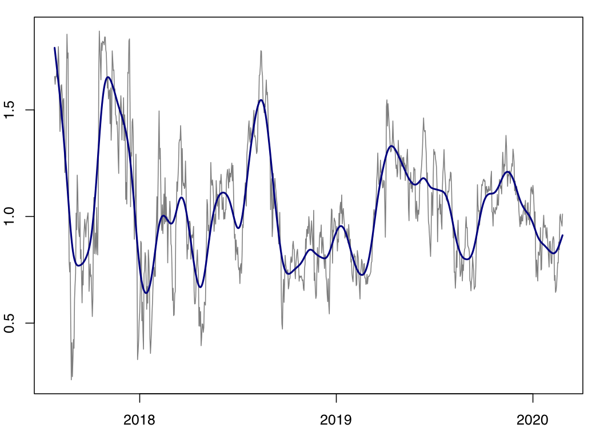

[](http://quantlet.de/)

## [](http://quantlet.de/) **CryptoDynamics_Nonlinear** [](http://quantlet.de/)

```yaml

Name of QuantLet : CryptoDynamics_Nonlinear

Published in : 'On Cointegration and Cryptocurrency Dynamics'

Description : 'Estimates a nonlinear VECM specification using cryptocurrency data. Plots the nonlinear part of the model'

Keywords : Cryptocurrencies, CRIX, Cointegration, Estimation, VECM

See also : 'CryptoDynamics_Series, Crypto_Dynamics_Wachter, CryptoDynamics_Scraping, CryptoDynamics_Estimation'

Author : Georg Keilbar, Yanfen Zhang

Submitted : March 24, 2020 by Georg Keilbar

```



### R Code
```r

rm(list = ls())

###############################
# Set directory and load data #
###############################

setwd("~/Dropbox/Cointegration and CC Dynamics/New Code")
data = read.csv("logprice.csv",header=T)
date = as.Date(read.csv("logprice.csv")[,2])
beta = read.csv("beta.csv")[,-1]

###########################
# Estimate nonlinear VECM #
###########################

logprice = as.matrix(data[,-c(1,2)])
dlogprice = diff(logprice,lag=1)

dx = dlogprice[-1,]
dx_1 =dlogprice[-nrow(dlogprice),]
z = t(t(beta)%*%t(logprice))[-c(1,nrow(logprice)),]

T = nrow(dx)
p = ncol(dx)
r = ncol(z)

M = 10000
set.seed(1234)
gamma = matrix(runif(r*M,-1,1),r,M)
gamma[1,]=rep(0,M)
MSE = rep(0, M)
for (m in 1:M){
  for (j in 1:p){
    G = 1 + tanh(gamma[,m] %*% t(z))
    zG = sweep(z,1,G,'*')
    MSE[m] = mean(lm(dx[,j]~cbind(zG,dx_1))$residuals^2)/p + MSE[m]
  }
}
gammahat = gamma[,which(MSE==max(MSE))]
Ghat = as.vector(1+tanh(gammahat %*% t(z)))

pdf(file = "CryptoDynamics_Nonlinear.pdf", width = 7, height = 5, family = "Helvetica") # defaults to 7 x 7 inches
par(mar=c(2,2,1,1))
plot(Ghat~date[-c(1,2)],type="l",xlab="",ylab="",col="grey50")
lines(x=date[-c(1,2)],y=smooth.spline(Ghat, spar=0.5)$y,col="navy",lwd=2)
dev.off()
```

automatically created on 2020-03-24