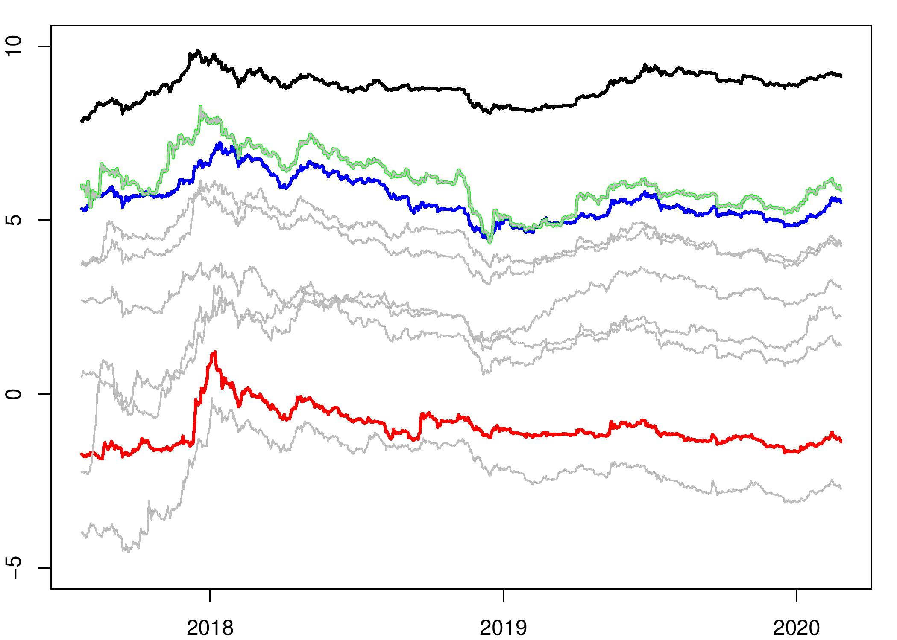

[](http://quantlet.de/)

## [](http://quantlet.de/) **CryptoDynamics_Series** [](http://quantlet.de/)

```yaml

Name of QuantLet : CryptoDynamics_Series

Published in : 'On Cointegration and Cryptocurrency Dynamics'

Description : 'Plots the log-prices of the 20 largest cryptocurrencies over a period from July 2017 - February 2020.'

Keywords : Cryptocurrencies, CRIX, Cointegration, Time series

See also : 'CryptoDynamics_Estimation, Crypto_Dynamics_Wachter, CryptoDynamics_Scraping'

Author : Georg Keilbar, Yanfen Zhang

Submitted : October 5 2019 by Georg Keilbar

```



### R Code
```r

rm(list = ls())

###############################
# Set directory and load data #
###############################

#setwd("~/...")
data = read.csv("logprice.csv",header=T)
date = as.Date(read.csv("logprice.csv")[,2])


########################################
# Joint time series plot of log prices #
########################################

pdf(file = "CryptoDynamics_Series.pdf", width = 7, height = 5, family = "Helvetica") # defaults to 7 x 7 inches
par(mar=c(2,2,1,1))
plot(data[,3]~date,type="l",ylim=c(-5,10),xlab="",ylab="",lwd=2)
lines(data[,4]~date,col="blue",lwd=2)
lines(data[,5]~date,col="red",lwd=2)
lines(data[,6]~date,col="green",lwd=2)
for(i in 6:20){lines(data[,i]~date,col="grey")}
dev.off()

```

automatically created on 2020-03-24