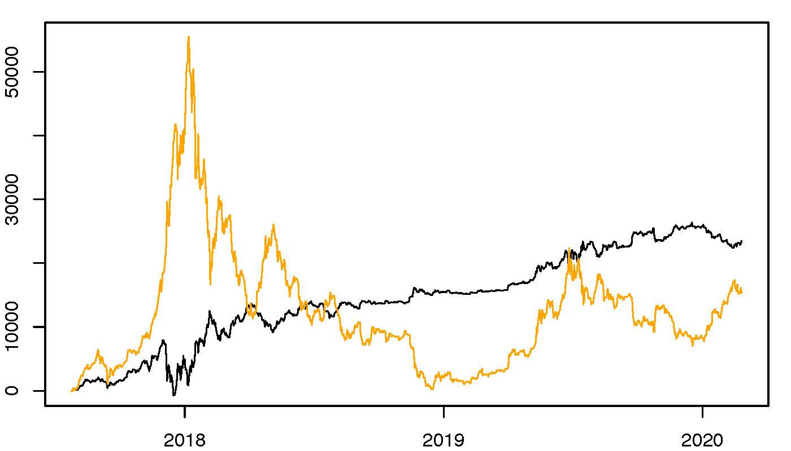
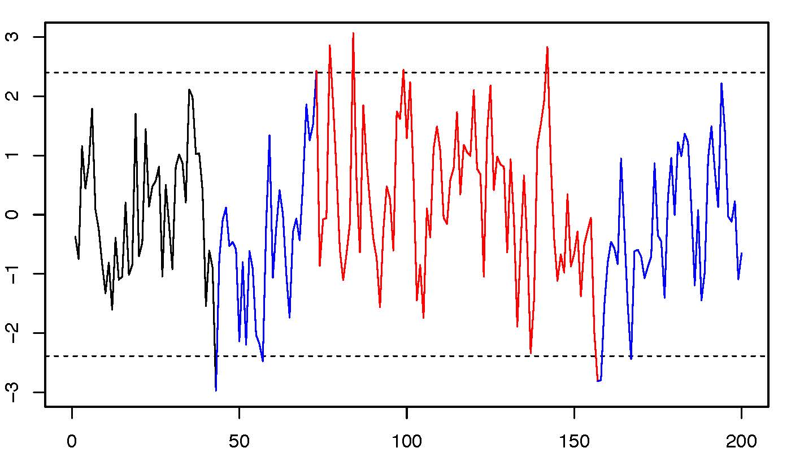

[](http://quantlet.de/)

## [](http://quantlet.de/) **CryptoDynamics_Trading** [](http://quantlet.de/)

```yaml

Name of QuantLet : CryptoDynamics_Trading

Published in : 'On Cointegration and Cryptocurrency Dynamics'

Description : 'Implementation of a cointegration-based trading algorithm. Visualization of the trading strategy and comparison to CRIX as an industry benchmark'

Keywords : Cryptocurrencies, CRIX, Cointegration, Trading

See also : 'CryptoDynamics_Series, Crypto_Dynamics_Wachter, CryptoDynamics_Estimation, CryptoDynamics_Scraping'

Author : Georg Keilbar, Yanfen Zhang

Submitted : March 2 2020 by Georg Keilbar

```





### R Code
```r

rm(list=ls())
library("tsDyn")
library("tseries")
library("xtable")
library("lattice")
library("igraph")

###############################
# Set directory and load data #
###############################

setwd("~/Dropbox/Cointegration and CC Dynamics/New Code")
data = read.csv("logprice.csv",header=T)
date = as.Date(read.csv("logprice.csv")[,2])
logprice = as.matrix(data[,-c(1,2)])
price = exp(logprice)
return = diff(price,lag=1)
beta = as.matrix(read.csv("beta.csv")[,-1])
crix = as.numeric(read.csv("crix.csv",sep=",")[1091:2036,2])

###################################
# Implementation Trading Strategy #
###################################

#Long term stochastic trends
z = t(t(beta)%*%t(logprice))
spread = t(t(beta)%*%t(price))
spreadreturn = diff(spread,lag=1)
r = ncol(beta)
T = nrow(logprice)

#Set lower and upper threshold

#log prices
lower = apply(z,2,function(u){mean(u)-sd(u)})
upper = apply(z,2,function(u){mean(u)+sd(u)})

#prices
lower = apply(spread,2,function(u){mean(u)-c*sd(u)})
upper = apply(spread,2,function(u){mean(u)+c*sd(u)})

#Get trading signals for each day and for each cointegration relation

#log prices
signal = matrix(0,nrow=T,ncol=r)
for (j in 1:r){
  for (t in 1:T){
    signal[t,j]=ifelse(t>1,signal[t-1,j],0)
    if (z[t,j]>upper[j]) {signal[t,j]=-1}
    if (z[t,j]<lower[j]) {signal[t,j]=1} 
  }
}

#prices
signal = matrix(0,nrow=T,ncol=r)
for (j in 1:r){
  for (t in 1:T){
    signal[t,j]=ifelse(t>1,signal[t-1,j],0)
    if (spread[t,j]>upper[j]) {signal[t,j]=-1}
    if (spread[t,j]<lower[j]) {signal[t,j]=1} 
  }
}

tradereturn = spreadreturn*signal[-T,]
totalreturn = apply(tradereturn,1,sum)


#############################
# Function Trading Strategy #
#############################

trading = function(price,beta,c){
  spread = t(t(beta)%*%t(price))
  spreadreturn = diff(spread,lag=1)
  r = ncol(beta)
  T = nrow(logprice)
  
  lower = apply(spread,2,function(u){mean(u)-c*sd(u)})
  upper = apply(spread,2,function(u){mean(u)+c*sd(u)})
  
  signal = matrix(0,nrow=T,ncol=r)
  for (j in 1:r){
    for (t in 1:T){
      signal[t,j]=ifelse(t>1,signal[t-1,j],0)
      if (spread[t,j]>upper[j]) {signal[t,j]=-1}
      if (spread[t,j]<lower[j]) {signal[t,j]=1} 
    }
  }
  tradereturn = spreadreturn*signal[-T,]
  totalreturn = apply(tradereturn,1,sum)
  cumreturn = cumsum(totalreturn)
  
  result = list(
  tradereturn = spreadreturn*signal[-T,],
  totalreturn = apply(tradereturn,1,sum),
  cumreturn = cumsum(totalreturn),
  totalprofit = sum(totalreturn),
  maxdraw = maxdrawdown(totalreturn),
  sharpe = sharpe(cumreturn),
  numtrade = sum(diff(signal)!=0)
  )

  return(result)
}

result = trading(price,beta,1)

#########################
# Plot Trading Strategy #
#########################

#One stochastic trend, lower/upper bounds

#Simulated example
set.seed(1234)
y = arima.sim(list(order=c(1,0,0),ar=0.5),n=200)
lower = mean(y) - 2*sd(y)
upper = mean(y) + 2*sd(y)

#Change colors (0 black, -1 red, +1 blue)
color = rep(0,length=length(y))
for (t in 2:length(y)){
  color[t]=color[t-1]
  if (y[t]>upper) {color[t]=-1}
  if (y[t]<lower) {color[t]=1} 
}

#Manual set trade periods
which(diff(color)!=0)

pdf(file = "strategy.pdf", width = 7, height = 4, family = "Helvetica")
par(mar=c(2,2,1,1))
plot((1:27),y[1:27],col="black",type="l",xlim=c(0,200),ylim=c(-3,3),xlab="",ylab="")
abline(h=c(lower,upper),lty=2)
lines((27:51),y[27:51],col="blue")
lines((51:181),y[51:181],col="red")
lines((181:200),y[181:200],col="blue")
dev.off()


###########################
# Plot Cumulative Profits #
###########################

#Compare with SP500 and CRIX

pdf(file = "performance.pdf", width = 7, height = 4, family = "Helvetica")
par(mar=c(2,2,1,1))
plot(result$cumreturn~date[-1],type="l",xlab="",ylab="",
     ylim=c(min(crix)-crix[1],max(crix)-crix[1]))
lines(crix-crix[1]~date,col="orange")
dev.off()

crix[T]-crix[1]
maxdrawdown(crix-crix[1])
sharpe(crix-crix[1])

```

automatically created on 2020-03-26